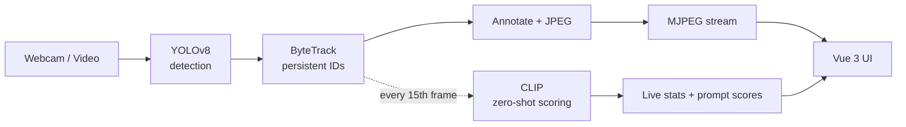

# VisionStream

Real-time object detection, tracking, and scene description for webcam and video streams, in
the browser. YOLOv8 detects objects, ByteTrack assigns IDs across frames, and CLIP scores each
frame against text prompts set at runtime. A FastAPI backend streams the annotated video to a
Vue 3 app.

[](https://github.com/vtanisha/VisionStream/actions/workflows/ci.yml)


<!-- Add a demo GIF at docs/demo.gif and uncomment:
<p align="center"></p>
-->

## Features

- Object detection and multi-object tracking with persistent IDs (YOLOv8 + ByteTrack).
- Frame scoring against text prompts, editable at runtime (CLIP, zero-shot).
- Webcam or uploaded video input.
- Runtime controls: prompt editor and COCO class filter.
- Live stats: FPS, objects tracked, unique IDs, per-stage latency, top prompt.
- MJPEG stream to the browser.
- Docker Compose setup.

## How it works



Each stage runs on its own thread, connected by depth-1 slots that keep the newest frame and
drop the rest. A slow stage loses frames instead of adding latency.

- YOLOv8 (Ultralytics) detects objects in each frame.
- ByteTrack assigns a persistent ID to each object using a Kalman motion model and IoU matching, with a two-pass high/low-confidence step that handles brief occlusion.
- CLIP (ViT-B/32) scores every 15th frame on a separate thread, ranking the prompts by cosine similarity to the frame.
- FastAPI serves the annotated frames as an MJPEG stream and exposes `/api/stats`. The Vue 3 app renders both.

## Tech stack

| Layer | Tools |
|---|---|
| Detection / tracking | Ultralytics YOLOv8, ByteTrack, OpenCV, PyTorch (MPS / CPU) |
| Scene understanding | OpenCLIP ViT-B/32 |
| Backend | FastAPI, Uvicorn, MJPEG streaming |
| Frontend | Vue 3, Vite |
| Packaging | conda (backend), Docker + docker-compose |

## Project structure

```
backend/
  config.py          settings + device resolution
  main.py            FastAPI: MJPEG stream, stats, prompt/class control, upload
  pipeline/
    engine.py        thread orchestration + frame-drop policy
    latest_slot.py   depth-1 overwrite slot
    detector.py      YOLOv8 + ByteTrack
    clip_scorer.py   CLIP scoring, cached text embeddings
    draw.py          boxes, per-ID colours, HUD overlay
    source.py        webcam / file input
    stats.py         rolling FPS + latency
scripts/
  smoke_test.py      YOLO + CLIP on a single frame
  bench.py           benchmark harness
  make_test_clip.py  synthetic test-clip generator
frontend/            Vue 3 + Vite SPA
Dockerfile(s) + docker-compose.yml
```

## Getting started

### Native (Apple Silicon / GPU)

```bash
conda env create -f environment.yml
conda activate objecttracker

python scripts/smoke_test.py      # YOLO + CLIP on one frame
python scripts/make_test_clip.py  # a bundled test clip (or drop your own .mp4 in data/)

uvicorn backend.main:app --reload --port 8000
```

Frontend, in a second terminal:

```bash
cd frontend
npm install
npm run dev        # http://localhost:5173  (Vite proxies /api to :8000)
```

### Docker (CPU)

```bash
docker compose up --build
# UI: http://localhost:5173   API: http://localhost:8000/api/health
```

Drop `.mp4` files in `./data` (mounted into the backend). Webcam is native-only — see
[run modes](#run-modes).

## Performance

Runs in real time on Apple Silicon (MPS), around 25 FPS end-to-end with detection, tracking,
and CLIP active. CLIP is the slowest stage, so it runs on every 15th frame on a separate
thread. CPU-only (including Docker) is slower.

Reproduce the full per-stage numbers:

```bash
python scripts/bench.py
```

Benchmarks measure speed, not tracking accuracy. The bundled test clip is synthetic; drop a
real clip in `data/` to evaluate tracking quality.

## Run modes

|            | Native (conda + MPS) | Docker |
|------------|----------------------|--------|
| Webcam     | ✅ | ❌ |
| Video file | ✅ | ✅ |
| Inference  | MPS (GPU) | CPU |
| Real-time  | ✅ ~25 FPS | ❌ |

Docker Desktop on Apple Silicon has no GPU passthrough and no host camera access, so the
container runs on CPU and disables webcam input. NMS runs on CPU even on MPS, since
`torchvision::nms` has no Metal kernel.

## Configuration

| Env var | Default | Meaning |
|---|---|---|
| `OT_DEVICE` | auto | `mps` or `cpu` (auto-picks `mps` when available) |
| `OT_CLIP_EVERY_N` | `15` | score every Nth frame with CLIP |
| `OT_YOLO_WEIGHTS` | `yolov8n.pt` | `yolov8n.pt`, `yolov8s.pt`, … |
| `OT_IN_DOCKER` | unset | `1` disables webcam and forces CPU |

## Limitations

- CLIP ranks the frame against the prompts you supply. The scores sum to 1, so there is always a top prompt even when none match. It scores the whole frame, not individual objects.
- ByteTrack uses motion only, with no appearance model. Objects crossing at similar speed can swap IDs, and an object that leaves and re-enters gets a new ID.
- Benchmarks measure speed, not tracking accuracy. The test clip is synthetic.

## Roadmap

- Tracking-accuracy evaluation (MOT-format metrics) on a real dataset
- Per-object CLIP (crop each track instead of scoring the whole frame)
- Deployable hosted demo
